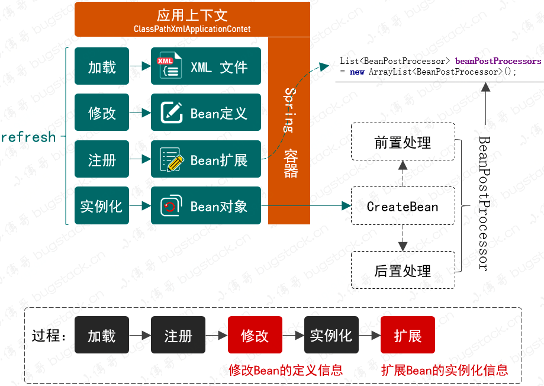

# Read Me First



**（面对接口编程）**

在ClassPathXmlApplicationContext中实现refresh方法刷新spring容器

```
public void refresh() throws BeansException {

        // 1.Create BeanFactory and load BeanDefinition
        refreshBeanFactory();

        // 2.get BeanFactory
        ConfigurableListableBeanFactory beanFactory = getBeanFactory();

        // 3.Invoke factory processors registered as beans in the context before beans are instantiated
        invokeBeanFactoryPostProcessors(beanFactory);

        // 4.BeanPostProcessor performs registration operations before other Bean objects are instantiated
        registerBeanPostProcessors(beanFactory);

        // 5.Instantiate singleton Bean objects in advance
        beanFactory.preInstantiateSingletons();
    }
```
通过属性注入在ApplicationContext中使用DefaultListableBeanFactory

- 一：bean加载与注册：  
  ResourceLoader加载文件获取对应的inputstream
  DefaultListableBeanFactory从中获取各个的BeanDefinition 
  BeanDefinitionReader读取并注册到BeanDefinitionRegistry(DefaultListableBeanFactory继承)中

- 二：bean修改：  
  ListableBeanFactory获取容器中所有BeanFactoryPostProcessor的子类，调用对应的postProcessBeanFactory方法
  
- 三：Bean扩展 
  在beanFactory中注册容器的BeanPostProcessor的子类
  
- 四：实例化Bean对象 
  DefaultListableBeanFactory调用getBean方法
  BeanPostProcessor前置处理->createBean()->BeanPostProcessor后置处理


